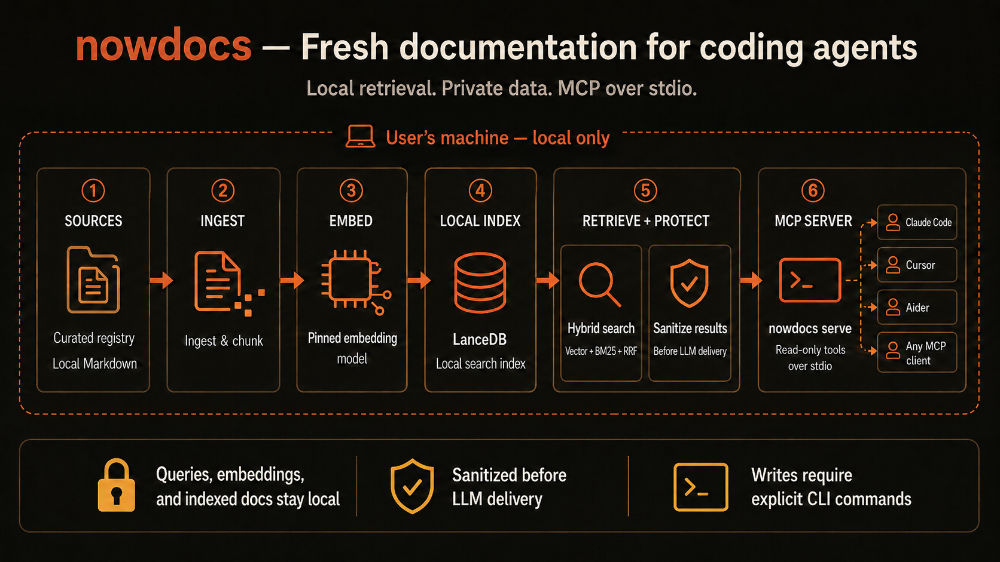

# nowdocs

> A local, single-binary MCP server that gives coding agents current third-party documentation.

Coding agents can confidently suggest APIs that have changed since their training data was collected. nowdocs indexes documentation on your machine and exposes it through MCP, so Codex CLI, Claude Code, Cursor, and other MCP clients can search current documentation instead of relying only on model memory.



**Current published release:** [v0.1.2](https://github.com/nowdocs/nowdocs/releases/tag/v0.1.2). The agent-first commands documented on `main` are planned for the next release; use the [v0.1.2 documentation](https://github.com/nowdocs/nowdocs/tree/v0.1.2) with the published binary. nowdocs is free to run, has no telemetry, and by default keeps queries, embeddings, and indexed documentation on your device.

## Why nowdocs

- **Local-first by default:** query text, embeddings, and document content stay on your machine unless you opt in to native Cohere reranking.
- **Hybrid retrieval:** semantic search, BM25 full-text search, and reciprocal-rank fusion (RRF).
- **MCP over stdio:** no listening port, host, or public service to configure.
- **Curated registry:** start with current Next.js, React, and Vue docsets, or ingest local Markdown documentation.
- **One Rust binary:** prebuilt releases for macOS, Linux musl, and Windows.

## Install

### Prebuilt binary

```bash
# Recommended: Cargo binstall verifies GitHub Release checksums.
cargo binstall nowdocs

# macOS or Linux through the Homebrew tap.
brew tap nowdocs-registry/nowdocs
brew install nowdocs
```

### Build from source

```bash
cargo install nowdocs
# or use the current repository checkout
cargo build --release
```

Source builds require a compatible Rust toolchain, `protoc`, and `curl` on `PATH`.

- macOS: `brew install protobuf`
- Debian/Ubuntu: `sudo apt-get install protobuf-compiler`

The first download-enabled model command, such as `nowdocs doctor --model` or `nowdocs smoke`, downloads the Apache-2.0 `jina-embeddings-v2-small-en` model (about 66 MB) from Hugging Face and then caches it locally. Run `nowdocs doctor --model` before your first search to make that download explicit. `nowdocs verify` never downloads it.

## Five-minute manual quick start

This path installs the curated Next.js docset, verifies retrieval, and starts the MCP server.

```bash
# 1. Check the local environment and download the model if it is missing.
nowdocs doctor --model

# 2. Install a curated docset.
nowdocs install nextjs

# 3. Confirm that retrieval returns useful documentation.
nowdocs smoke nextjs "middleware matcher configuration"

# 4. Start the local MCP server.
nowdocs serve
```

`serve` uses newline-delimited JSON over stdio. It never binds a host or port.

Register the server with an MCP client using this generic configuration:

```json
{
  "mcpServers": {
    "nowdocs": {
      "command": "nowdocs",
      "args": ["serve"]
    }
  }
}
```

Client-specific behavior for Codex CLI, Claude Code, Cursor, Claude Desktop, and generic MCP clients is in [MCP Clients](docs/MCP_CLIENTS.md).

## Agent-first setup

Current builds from `main` expose a deterministic JSON contract so an agent can inspect first, propose one plan, wait for explicit approval, apply it, and verify the result:

```bash
# Read-only and offline-safe.
nowdocs capabilities --json
nowdocs status --json

# Planning may fetch registry metadata, but it does not install the docset or
# change client configuration. It stores a private, expiring local plan.
nowdocs setup plan --client codex --docset react --online --json

# Run only after the user approves the exact plan hash returned above.
nowdocs setup apply --plan-hash <plan-hash> --json

# Read-only, offline verification. This command never downloads the model.
nowdocs verify --docset react --client codex --json
```

Agents must inspect the JSON `status`, `code`, `next_actions`, and optional `rollback` object instead of treating exit code 0 as unconditional success. See [Agent Setup](docs/AGENT_SETUP.md) for the complete approval and rollback protocol.

Discovery and planning are separate from mutation. `setup apply` requires the exact stored plan hash and explicit user approval. Automatic rollback accepts only setup-owned operation IDs, and a successful rollback consumes that authorization so it cannot be replayed against a user-recreated registration.

The returned `setup-apply` action discloses the highest planned risk and whether apply may use the network. It is not marked fully reversible: a returned rollback operation can restore an operation-owned client configuration change, but it does not uninstall or downgrade a docset.

## Optional native Cohere reranking

Reranking is disabled by default. When enabled, it sends search inputs to
Cohere using your account. Read the [native Cohere reranking guide](docs/RERANKING.md)
before enabling it: it covers configuration, data transfer, failure fallback,
model selection, MCP-client environments, and the current OpenRouter boundary.

## Common workflows

| Goal | Command |
|---|---|
| Discover the machine contract | `nowdocs capabilities --json` |
| Inspect local state without changing it | `nowdocs status --json` |
| Plan one client plus one docset | `nowdocs setup plan --client <client> --docset <docset> [--online] --json` |
| Apply an approved setup plan | `nowdocs setup apply --plan-hash <hash> --json` |
| Verify local retrieval and client config | `nowdocs verify --docset <docset> [--client <client>] --json` |
| List registry docsets | `nowdocs registry list` |
| Install a curated docset | `nowdocs install <docset>` |
| Import local Markdown | `nowdocs ingest <dir> <name> --license MIT --source-url <url>` |
| Verify retrieval | `nowdocs smoke <docset> [query]` |
| Start the MCP server | `nowdocs serve` |
| List installed docsets | `nowdocs list-installed` |
| Update a docset | `nowdocs update <docset>` |
| Rebuild a local cache | `nowdocs rebuild <docset>` |
| Diagnose or safely repair setup | `nowdocs doctor [--model] [--repair]` |
| Inspect the cache | `nowdocs cache status` |

Use `nowdocs ingest` when you own or are allowed to use the source material. For CC-BY-4.0 documentation, supply the required `--attribution` value. Use `nowdocs share <docset>` to create a text-and-manifest contribution bundle; it intentionally excludes vectors.

## Documentation

- [Getting Started](docs/GETTING_STARTED.md) - installation, ingest, smoke testing, and recovery.
- [Agent Setup](docs/AGENT_SETUP.md) - machine contract, approval boundary, setup, verification, and rollback.
- [MCP Clients](docs/MCP_CLIENTS.md) - client-specific configuration and verification.
- [Troubleshooting](docs/TROUBLESHOOTING.md) - model, cache, registry, MCP, and source-build failures.
- [Architecture](docs/ARCHITECTURE.md) - data flow and security boundaries.
- [Contributing](CONTRIBUTING.md) - code and docset contribution workflow.

## Security and privacy

MCP exposes only the read-only `nowdocs_search` and `nowdocs_list` tools. Commands that modify local state, such as `install`, `ingest`, `uninstall`, and `setup apply`, are CLI-only. Agent setup separates planning from mutation and marks state-changing next actions as requiring confirmation.

Before documentation reaches an LLM, nowdocs sanitizes returned text and metadata to reduce prompt-injection content. Registry downloads are restricted to trusted registry releases and verified with SHA-256. Shared docsets contain text and manifests only; registry CI rebuilds vectors with the pinned model.

See the [Privacy Policy](docs/PRIVACY.md), [Threat Model](docs/THREAT_MODEL.md), and [Security Policy](.github/SECURITY.md) for details.

After a successful `install`, `update`, `ensure`, `registry`, `smoke`, or `doctor` command, nowdocs checks GitHub for a newer binary release at most once every 24 hours and prints a reminder to stderr. It never downloads or installs an update automatically. Set `NOWDOCS_UPDATE_CHECK=0` to disable the check.

## Current scope and limitations

- The curated registry currently provides Next.js, React, and Vue docsets.
- Retrieval is English-first and uses the fixed Candle/Jina embedding backend.
- Codex CLI, Claude Code, and Cursor support conditional managed setup. Claude Desktop currently requires a separately distributed `.mcpb` extension; nowdocs does not ship that extension yet. Other MCP clients use generated configuration and manual installation.
- The Next.js real-corpus evaluation gate currently reports recall@5 of 0.900 and MRR of 0.720. It does not represent accuracy for every docset or query.
- Releases are not code-signed. Verify release checksums; `cargo-binstall` does this automatically.
- Five platform release assets are built and checksum-verified. Homebrew CLI installation should still be rechecked on a machine with Homebrew available.

## Contributing and policies

nowdocs is licensed under `MIT OR Apache-2.0`. Contributions use the Developer Certificate of Origin (DCO), not a CLA. See [CONTRIBUTING.md](CONTRIBUTING.md) and [CODE_OF_CONDUCT.md](CODE_OF_CONDUCT.md).

The public registry is curated and accepts only documentation whose license permits redistribution. Review the [Acceptable Use Policy](docs/AUP.md), [DMCA Policy](docs/DMCA.md), [Trademark Policy](docs/TRADEMARK.md), and [NOTICE](NOTICE).

Do not report security vulnerabilities in a public issue. Use GitHub's private vulnerability-reporting flow or email `legal@gwmmai.com` with `[nowdocs security]` in the subject line.
