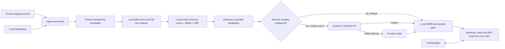
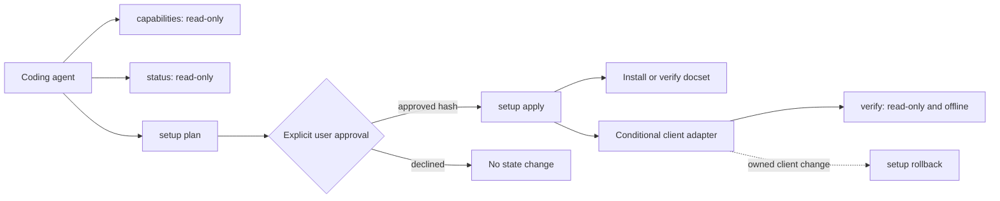

# Architecture

nowdocs v0.2.0 is a local-first, single-binary Rust MCP server for retrieving current third-party documentation during coding-agent sessions. By default, it keeps query text, embeddings, and indexed document content on the user's device. Users can explicitly opt in to [native Cohere reranking](RERANKING.md), which sends disclosed search inputs to Cohere.

## Retrieval data flow

Local hybrid retrieval builds the candidate pool before any optional remote call. When Cohere reranking is enabled, nowdocs sends only the query and sanitized, size-bounded candidate text described in [Native Cohere Reranking](RERANKING.md). Indexing, embeddings, cache paths, chunk identifiers, local diversity ranking, and answer-confidence decisions remain local.

## Agent setup control plane

Agent automation is deliberately separate from the read-only MCP data plane:

`setup plan` may fetch trusted registry metadata when `--online` is present and stores a private, expiring plan. It does not install a docset or modify a client. `setup apply` is the explicit mutation boundary and may fetch the package pinned by the plan. Apply rejects missing, expired, tampered, or stale plans.

The combined setup action is not fully reversible. Guarded rollback covers only an operation-owned client configuration change, not docset installation or update. A successful rollback consumes its setup-owned authorization, preventing replay against a registration the user creates later.

Client adapters fail closed:

- Codex CLI and Claude Code use their official MCP CLI commands and never edit their configuration files directly.
- Cursor uses no-follow path checks, atomic replacement, an operation-owned backup, and digest-guarded rollback.
- Claude Desktop returns MCPB guidance only and never edits the legacy Desktop configuration.
- Generic clients receive deterministic configuration for manual installation.

## Main components

- `ingest`: validates and chunks local Markdown documentation.
- `embedder`: runs the pinned Jina embedding model through Candle.
- `store`: persists document chunks and performs hybrid retrieval in LanceDB.
- `rerank`: optionally reorders local candidates through Cohere after explicit configuration.
- `registry`: installs, updates, shares, and removes curated docsets.
- `mcp`: exposes read-only `nowdocs_search` and `nowdocs_list` tools over stdio.
- `agent_contract` and `inspect`: expose deterministic capabilities and read-only local status for agents.
- `automation`: stores validated plans, serializes state changes, records owned operations, and performs guarded rollback.
- `clients`: implements capability-specific detection, generation, conditional apply, verification, and rollback boundaries.
- `verify`: proves local retrieval and optional client configuration without network access or model download.
- `doctor` and `smoke`: diagnose local setup and verify useful retrieval.

## Security boundaries

- The MCP interface is read-only; state-changing operations are explicit CLI commands.
- Agent setup separates planning from applying, marks state-changing next actions as requiring confirmation, and never exposes writable MCP tools.
- Client writes stay inside an approved user root, reject unsafe symbolic links and permissions, and preserve unrelated configuration.
- Retrieved text and metadata are sanitized before they reach an LLM.
- Optional Cohere reranking is disabled by default, validates configuration at startup, limits transmitted data, and falls back to the unchanged local ordering when the request fails.
- Registry downloads are restricted to the trusted registry release domain and verified with SHA-256.
- Shared docsets contain text and manifests only. Registry CI rebuilds vectors using the pinned model to avoid vector injection and model drift.

## Scope

nowdocs is English-first and uses a fixed Candle/Jina embedding backend. The initial curated registry contains Next.js, React, and Vue docsets. See [Getting Started](GETTING_STARTED.md) for installation, [Agent Setup](AGENT_SETUP.md) for the automation contract, [MCP Clients](MCP_CLIENTS.md) for client behavior, and [Native Cohere Reranking](RERANKING.md) for the remote opt-in boundary.
