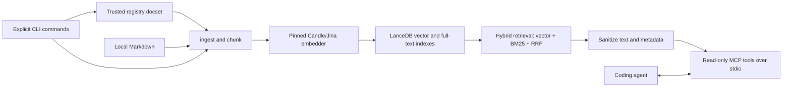

# Architecture

nowdocs is a local, single-binary Rust MCP server for retrieving current third-party documentation during coding-agent sessions. By default, it keeps query text, embeddings, and indexed document content on the user's device. Users can explicitly opt in to [native Cohere reranking](../README.md#optional-native-cohere-reranking), which sends search inputs to Cohere.

## Data flow

```text
Markdown or registry docset
  -> ingest and chunk
  -> Candle/Jina embeddings
  -> LanceDB full-text and vector indexes
  -> hybrid retrieval (BM25 + vector + RRF)
  -> sanitized MCP response over stdio
```



## Main components

- `ingest`: validates and chunks local Markdown documentation.
- `embedder`: runs the pinned Jina embedding model through Candle.
- `store`: persists document chunks and performs hybrid retrieval in LanceDB.
- `registry`: installs, updates, shares, and removes curated docsets.
- `mcp`: exposes read-only `nowdocs_search` and `nowdocs_list` tools over stdio.
- `doctor` and `smoke`: diagnose local setup and verify useful retrieval.

## Security boundaries

- The MCP interface is read-only; state-changing operations are explicit CLI commands.
- Retrieved text and metadata are sanitized before they reach an LLM.
- Registry downloads are restricted to the trusted registry release domain and verified with SHA-256.
- Shared docsets contain text and manifests only. Registry CI rebuilds vectors using the pinned model to avoid vector injection and model drift.

## Scope

v0.1.2 is English-first and uses a fixed Candle/Jina embedding backend. The initial curated registry contains Next.js, React, and Vue docsets. See [Getting Started](GETTING_STARTED.md) for installation and [MCP Clients](MCP_CLIENTS.md) for client configuration.
