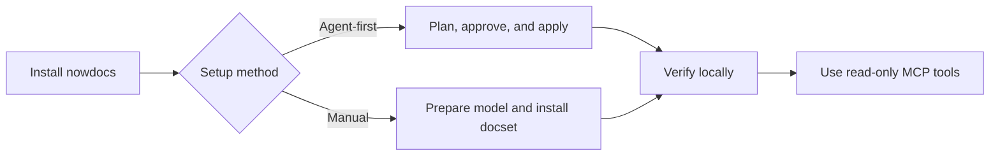

# Getting Started with nowdocs

This is the supported path from a new installation to a working local MCP documentation server.



## 1. Install nowdocs

Install a prebuilt binary when possible:

```bash
cargo binstall nowdocs
```

On macOS or Linux, Homebrew is also available:

```bash
brew tap nowdocs-registry/nowdocs
brew install nowdocs
```

For a source build, install Rust, `protoc`, and `curl`, then run one of:

```bash
cargo install nowdocs
# or, from a repository checkout
cargo build --release
```

`protoc` is provided by `brew install protobuf` on macOS or `sudo apt-get install protobuf-compiler` on Debian/Ubuntu.

## 2. Choose a setup method

### Agent-first setup on current `main`

Current builds from `main` let an agent discover capabilities, inspect state, prepare one plan, wait for approval, apply it, and verify the result:

```bash
nowdocs capabilities --json
nowdocs status --json
nowdocs setup plan --client codex --docset nextjs --online --json
```

Review the returned risk, network access, reversibility, and exact `setup apply` argv before it runs. Applying a plan may fetch and install or update the selected docset. Then verify offline:

```bash
nowdocs setup apply --plan-hash <plan-hash> --json
nowdocs verify --docset nextjs --client codex --json
```

Use [Agent Setup](AGENT_SETUP.md) for the required confirmation, result handling, and rollback rules. If the installed binary does not expose these commands, use the manual path below.

### Manual setup

The manual path works with the current v0.1.2 release and remains useful for advanced workflows.

## 3. Diagnose the environment and prepare the model

```bash
nowdocs doctor
nowdocs doctor --model
```

The second command downloads the Jina embedding model if it is not already cached. Use `--json` when an agent or CI needs machine-readable diagnostics.

## 4. Install a curated docset

Browse the public catalog if you are unsure what is available:

```bash
nowdocs registry list
```

For the first run, install Next.js:

```bash
nowdocs install nextjs
```

To index Markdown that you are allowed to use locally instead, run:

```bash
nowdocs ingest ./my-docs my-docset --license MIT --source-url https://github.com/org/repo
```

For CC-BY-4.0 content, include attribution:

```bash
nowdocs ingest ./my-docs my-docset \
  --license CC-BY-4.0 \
  --attribution "Docs by Example Authors" \
  --source-url https://github.com/org/repo
```

## 5. Verify retrieval before configuring a client

Current builds from `main` provide read-only, offline verification:

```bash
nowdocs verify --docset nextjs --json
```

`verify` never downloads the model. If it reports `model_missing`, run `nowdocs doctor --model` explicitly and retry.

The v0.1.2 manual retrieval check is:

```bash
nowdocs smoke nextjs "middleware matcher configuration"
```

For JSON output suitable for automation:

```bash
nowdocs smoke nextjs "middleware matcher configuration" --json --top-k 3
```

If this reports missing or corrupt model files, run `nowdocs doctor --model` again.

## 6. Configure an MCP client

Use this generic configuration when the client accepts MCP JSON:

```json
{
  "mcpServers": {
    "nowdocs": {
      "command": "/absolute/path/to/nowdocs",
      "args": ["serve"]
    }
  }
}
```

Use an absolute binary path because desktop applications often start with a restricted `PATH`. See [MCP Clients](MCP_CLIENTS.md) for Codex CLI, Claude Code, Cursor, Claude Desktop, and generic-client behavior.

## 7. Understand the server boundary

The client starts:

```bash
nowdocs serve
```

The server uses newline-delimited JSON over stdio. It does not bind a host or port, and it exposes no state-changing MCP tools.

Native Cohere reranking is optional. If you explicitly enable it, the server process sends disclosed search inputs to Cohere instead of operating local-only. See the [native Cohere reranking guide](RERANKING.md) before setting its environment variables.

## 8. Recovery commands

Inspect cache state:

```bash
nowdocs cache status
nowdocs cache status --json
```

Clean stale staging directories only:

```bash
nowdocs cache clean-staging --older-than 1h
```

Run safe staging-directory repair through doctor:

```bash
nowdocs doctor --repair
```

`doctor --repair` and `cache clean-staging` must not remove active docsets.

For an agent-managed client change, use `setup rollback` only when the apply response supplied a rollback object and operation id. Rollback restores only the operation-owned client configuration change; it does not uninstall or downgrade a docset, and it refuses to overwrite later user edits. A successful rollback consumes its setup-owned authorization, so the same operation id cannot be replayed against a registration the user creates later.

## 9. Binary update reminders

After a successful `install`, `update`, `ensure`, `registry`, `smoke`, or `doctor` command, nowdocs checks GitHub for a newer binary release at most once every 24 hours. If a newer version is found, it prints a package-manager-neutral reminder to stderr:

```text
A newer version of nowdocs is available (<version>).
Update using the package manager you used to install nowdocs.
https://github.com/nowdocs/nowdocs/releases/latest
```

nowdocs never downloads or installs a binary update automatically. `nowdocs serve` may also display a previously discovered reminder from the local cache on stderr, but it never makes a network request for this purpose.

To disable all version checks and reminders, set:

```bash
export NOWDOCS_UPDATE_CHECK=0
```
