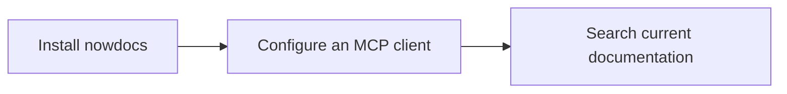

# Getting Started with nowdocs

This is the supported path from a new installation to a working local MCP documentation server.



## 1. Install nowdocs

Install a prebuilt binary when possible:

```bash
cargo binstall nowdocs
```

On macOS or Linux, Homebrew is also available:

```bash
brew tap nowdocs-registry/nowdocs
brew install nowdocs
```

For a source build, install Rust, `protoc`, and `curl`, then run one of:

```bash
cargo install nowdocs
# or, from a repository checkout
cargo build --release
```

`protoc` is provided by `brew install protobuf` on macOS or `sudo apt-get install protobuf-compiler` on Debian/Ubuntu.

## 2. Diagnose the environment and prepare the model

```bash
nowdocs doctor
nowdocs doctor --model
```

The second command downloads the Jina embedding model if it is not already cached. Use `--json` when an agent or CI needs machine-readable diagnostics.

## 3. Install a curated docset

Browse the public catalog if you are unsure what is available:

```bash
nowdocs registry list
```

For the first run, install Next.js:

```bash
nowdocs install nextjs
```

To index Markdown that you are allowed to use locally instead, run:

```bash
nowdocs ingest ./my-docs my-docset --license MIT --source-url https://github.com/org/repo
```

For CC-BY-4.0 content, include attribution:

```bash
nowdocs ingest ./my-docs my-docset \
  --license CC-BY-4.0 \
  --attribution "Docs by Example Authors" \
  --source-url https://github.com/org/repo
```

## 4. Verify retrieval before configuring a client

```bash
nowdocs smoke nextjs "middleware matcher configuration"
```

For JSON output suitable for automation:

```bash
nowdocs smoke nextjs "middleware matcher configuration" --json --top-k 3
```

If this reports missing or corrupt model files, run `nowdocs doctor --model` again.

## 5. Start the MCP server

```bash
nowdocs serve
```

The server uses newline-delimited JSON over stdio. It does not bind a host or port.

## 6. Configure an MCP client

Use this generic configuration when your client accepts MCP JSON:

```json
{
  "mcpServers": {
    "nowdocs": {
      "command": "nowdocs",
      "args": ["serve"]
    }
  }
}
```

See [`MCP_CLIENTS.md`](MCP_CLIENTS.md) for Cursor, Claude Code, Claude Desktop, and Aider guidance.

## 7. Recovery commands

Inspect cache state:

```bash
nowdocs cache status
nowdocs cache status --json
```

Clean stale staging directories only:

```bash
nowdocs cache clean-staging --older-than 1h
```

Run safe staging-directory repair through doctor:

```bash
nowdocs doctor --repair
```

`doctor --repair` and `cache clean-staging` must not remove active docsets.
