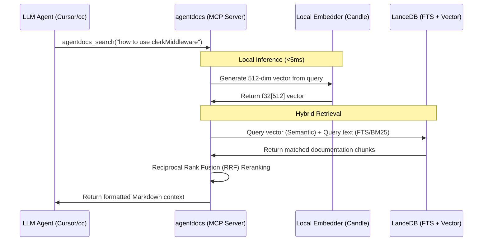

# System Design Spec: agentdocs

> ⚠️ **本文档为初稿，已被取代**：逐环节深度评审 + ground-truth 核实后的定稿见 [`2026-06-28-nowdocs-design-review.md`](./2026-06-28-nowdocs-design-review.md)（项目已改名 `nowdocs`、canonical crate 重选为 Next.js+React+Vue、share 改发文本 CI 重建、CJK defer v2、DCO/不签名等）。本文保留作历史参考，勿据此实现。

A Rust-based, zero-config, single-binary Model Context Protocol (MCP) server that runs locally to provide LLM coding agents (Cursor, Claude Code, etc.) with up-to-date, hybrid-searchable third-party developer documentation.

---

## 1. Executive Summary

### The Problem
AI coding agents (e.g., Cursor, Claude Code, Aider) rely on LLMs whose training data cutoff is often months or years old. Fast-moving developer libraries (such as Next.js 15, Clerk Auth V2, Tailwind v4) frequently update their APIs, leading to LLMs hallucinating deprecated patterns and wasting developers' hours.

### The Solution: `agentdocs`
`agentdocs` is a self-contained Rust command-line tool and MCP server that bridges this gap. It provides:
1. **GitHub Documentation Registry**: A community-driven repository containing pre-embedded, version-controlled developer documentation database packages.
2. **In-Process Crawler**: Utilizes the Rust `obscura` crate to crawl sites stealthily and dump them as clean, code-optimized Markdown.
3. **Local Vector & Hybrid Search**: Embeds documents locally using a 60MB `jina-embeddings-v2-small-en` ONNX model (running locally on CPU in under 10ms) and indexes them in a local, embedded `lancedb` instance.
4. **Zero-Config MCP Server**: Exposes standard tools (e.g., `agentdocs_search`) via stdio, allowing any MCP-compliant agent to perform instant, offline documentation retrieval.

---

## 2. Architecture & Components

`agentdocs` is compiled into a single static binary containing the following modules:

```
                  ┌──────────────────────────────────────────────┐
                  │                 agentdocs CLI                │
                  └──────────────────────┬───────────────────────┘
                                         │
        ┌────────────────────────────────┼──────────────────────────────┐
        ▼                                ▼                              ▼
┌──────────────────┐             ┌──────────────────┐           ┌──────────────────┐
│  Crawler Module  │             │  Embedder Module │           │  Database Module │
│  - obscura crate │             │  - ONNX / ort    │           │  - lancedb       │
│  - HTML-to-MD    │             │  - jina-v2-small │           │  - Vector + FTS  │
└──────────────────┘             └──────────────────┘           └──────────────────┘
```

### 2.1 Crawler Module (`obscura`)
* **Role**: Fetch documentation pages and convert them to clean Markdown.
* **Mechanism**: Uses the `obscura` Rust library to load pages in-process (avoiding heavy external Chrome headless processes). Bypasses Cloudflare and other bot detectors using native stealth randomization.
* **Chunking**: Implements a code-aware document splitter that chunks markdown by headings, list blocks, and code segments, maintaining structural integrity up to a maximum context window.

### 2.2 Embedder Module (`ort` / `candle`)
* **Role**: Translate text chunks and user queries into vector coordinates.
* **On-Demand Loading**: To keep the initial CLI binary size under 20MB, model files are downloaded on-demand upon first run and cached locally in `~/.cache/agentdocs/models/`.
* **Configurable Baseline Model**: Defaults to `jina-embeddings-v2-small-en` (512-dimensional vectors, ~60MB ONNX format). Users can customize the model in `agentdocs.toml` to alternate options such as `all-MiniLM-L6-v2` (~22MB) or `multilingual-e5-small` (~90MB) for bilingual retrieval.
* **Execution**: Executed locally on the CPU using Hugging Face's `candle` crate or `ort` (ONNX Runtime Rust bindings).
* **Performance**: A typical single-sentence query is embedded in under 5ms, utilizing less than 50MB of RAM.

### 2.3 Database Module (`lancedb`)
* **Role**: Local storage of text chunks and high-speed vector/text index retrieval.
* **Mechanism**: Uses the embedded, serverless `lancedb` Rust engine.
* **Hybrid Search**: Performs a combination of:
  - **Vector Search (Semantic)**: Finds semantically matching concepts using L2 distance/Cosine similarity.
  - **Full-Text Search (FTS/BM25)**: Lexically matches exact API names, variable names, or keywords (e.g., `clerkMiddleware`).
  - **Reranker**: Merges results from vector and FTS search using Reciprocal Rank Fusion (RRF) to output the top 3-5 most relevant snippets.

### 2.4 MCP Server Interface
* **Role**: Interface with LLM clients over stdio.
* **Tool Exposed**:
  - `agentdocs_search(query: String, doc_set: Option<String>) -> String`
    - Performs hybrid search on the database and returns a formatted Markdown block of the matched documentation chunks, complete with source URLs and API versions.

---

## 3. Core Workflows

### 3.0 Query RAG Retrieval Flow
The following sequence diagram illustrates how `agentdocs` handles a search query locally when invoked by an LLM agent:



### 3.1 Synchronizing pre-compiled Docs (The Default Path)
```
Developer runs: agentdocs install nextjs
  ├── 1. Client fetches release assets from GitHub Registry
  ├── 2. Downloads nextjs-lancedb.tar.gz
  └── 3. Unpacks it into ~/.config/agentdocs/db/nextjs/
```

### 3.2 In-Process Custom Crawling & Local Indexing
```
Developer runs: agentdocs crawl https://my-private-api.com/docs --name my-api
  ├── 1. Obscura crawls pages in-process, cleaning HTML -> MD
  ├── 2. Chunking engine splits MD text
  ├── 3. Local ONNX embedder generates 512-dimensional vectors
  └── 4. Writes chunks & vectors into local LanceDB table
```

### 3.3 Community Contribution (Share)
```
Developer runs: agentdocs share my-api
  ├── 1. Zips local LanceDB directory
  └── 2. Generates a metadata manifest for a Pull Request to agentdocs-registry
```

### 3.4 Registry Configuration Schema (`scraper.toml`)
To allow the community to crawl and ingest documentation sites systematically, the project registry maintains `.toml` scraper configurations. Example structure:

```toml
# registry/clerk-auth.toml
name = "clerk-auth"
entry_url = "https://clerk.com/docs"
max_depth = 3
concurrency_limit = 5

[selector]
# CSS selectors to keep for parsing
include = ["article", ".main-content", "#docs-body"]
# CSS selectors to discard to remove navigation noise
exclude = ["nav", "footer", ".sidebar", ".ads-container"]
# Custom mapping for extraction
title_selector = "h1"
```

---

## 4. Design Decisions & Trade-offs

### 4.1 Pure Rust Embedding Engine (`candle` over `ort`)
* **Decision**: Adopt Hugging Face's `candle` library as the core embedding engine instead of `ort` (ONNX Runtime).
* **Rationale**: `candle` is written in 100% pure Rust and requires no external C++ dynamic libraries (`libonnxruntime.so`/`.dylib`) to be linked at compile or runtime. This ensures that the final compiled `agentdocs` binary is statically linked, zero-dependency, and extremely easy to distribute across different operating systems and architectures (Linux musl, macOS Apple Silicon, Windows) via curl or package managers.
* **Model Format**: The model weights will be loaded locally in `safetensors` format.

---

## 5. Verification & Test Plan

### Automated Verification
* **Unit Tests**:
  - Verify chunking boundaries on various Markdown file structures.
  - Verify Cosine Similarity results from the local embedding engine against a test query.
* **Integration Tests**:
  - Mock MCP stdio requests and assert JSON-RPC compliance.

### Manual Verification
1. Setup a local `agentdocs` instance with `nextjs` and `clerk` docs.
2. Configure a local Claude Code (`cc`) instance to connect to `agentdocs` over stdio.
3. Prompt Claude: *"How do I write a middleware in Next.js using Clerk?"*
4. Assert that Claude calls `agentdocs_search`, receives the matching v2 documentation chunks, and successfully generates correct, up-to-date code.
