# Retrieval Confidence Code-Agent Orchestration Design

## Purpose

Implement the approved retrieval-confidence pipeline with explicit ownership:
Kimi performs bounded code changes; Codex and the maintainer jointly perform
data labeling, metric interpretation, public-document wording, review, and all
release gates. This document controls task packaging and handoff behavior. The
retrieval-confidence design and implementation plan remain the behavioral source
of truth.

## Operating rules

- Every code package has one Kimi owner, one isolated worktree, one branch, one
  durable task spec, and one ephemeral prompt.
- The durable task spec is the complete execution contract. The prompt only
  identifies the spec, worktree, branch, and return format.
- Prompts live only under `tmp/code-agent-prompts/`, which is ignored by Git.
  They are never staged or committed and are deleted after package acceptance.
- Kimi does not push, merge, lower a threshold, tune against frozen test data,
  use `--no-verify`, or expand scope.
- Codex and the maintainer jointly approve every package before its commit is
  integrated into the orchestration branch. A dependent package never starts
  from an unaccepted or dirty dependency.
- Code packages are assigned by risk, not size. L3 and L4 require a reviewed
  task spec and a Codex acceptance pass before the next dependent wave starts.

## Ownership model

| Class | Owner | Required record |
|---|---|---|
| Code | Kimi | Durable task spec, ephemeral prompt, Kimi return report, reviewed commit |
| Non-code | Codex + maintainer | Reviewed data, decision record, or baseline report |
| Review | Codex + maintainer | Acceptance record against task spec |
| Gate | Codex + maintainer | Explicit pass/fail decision and evidence |

Mixed work is split rather than silently delegated. In particular, the
implementation of a validator belongs to Kimi while relevance labeling belongs
to Codex and the maintainer; smoke/MCP code belongs to Kimi while public wording
belongs to Codex and the maintainer.

## Code packages

| ID | Goal | Difficulty | Source plan tasks | Blocked by | Unblocks |
|---|---|---:|---|---|---|
| C01 | Add evaluation schema, validator, graded metrics, and shared answer-state enum. | L3 | 1–2 | none | C03, N01 |
| C02 | Add behavior-preserving retrieval traces and raw-cosine evidence capture. | L3 | 3 | none | C03, C04 |
| C03 | Add the versioned JSON evaluator and report contract. | L3 | 4 | C01, C02 | N02, C07, C09 |
| C04 | Preserve hybrid channel ranks with a LanceDB-compatible RRF adapter. | L4 | 6 | C02, G01 | G02, C05, C07 |
| C05 | Complete binary-compatible runtime answer-state decisions. | L3 | 7 | C04, G02 | C06, C07, C08 |
| C06 | Implement MCP and smoke response/exit contracts. | L3 | 8 code scope | C05 | N03, G04 |
| C07 | Implement deterministic global-policy calibration and split isolation. | L4 | 9 | C03, C04, C05, G01 | N04, G03, C08 |
| C08 | Embed and activate the frozen policy after frozen-test approval. | L4 | 10 code scope | C07, G03 | C09, G04 |
| C09 | Add three-docset fixture preparation and JSON-gated CI. | L4 | 11 code scope | C03, C08 | G04 |
| C10 | Add automated count, split, and near-domain gates for reviewed evaluation suites. | L2 | 5 Step 3 | C03, N01 fixture data | G01 |

### Difficulty rationale

- C01 changes cross-module evaluation types and creates the state enum consumed
  by runtime work, so it is L3 rather than an isolated test change.
- C02 changes retrieval instrumentation and the evidence boundary without
  changing results; cross-module runtime behavior makes it L3.
- C03 couples store diagnostics, retrieval traces, a release example, and a
  versioned report contract, making it L3.
- C04 changes hybrid ranking data flow and has a latency/compatibility gate;
  this is L4 retrieval behavior.
- C05 and C06 alter public runtime/CLI/MCP contracts, making them L3.
- C07, C08, and C09 govern ranking policy or release CI gates, making them L4.

## Non-code, review, and gate work

| ID | Owner | Work | Entry condition | Exit condition |
|---|---|---|---|---|
| N01 | Codex + maintainer | Curate Next.js, React, and Vue relevance families and targets. | C01 accepted | Three reviewed suites satisfy count/split rules. |
| G01 | Codex + maintainer | Validate dataset schema, family counts, target existence, and review record. | C03 and N01 complete | Explicit approval to capture the baseline. |
| N02 | Codex + maintainer | Capture and interpret binary baseline, risk groups, and latency. | G01 passed | Baseline document records corpus identity and metrics. |
| G02 | Codex + maintainer | Compare RRF adapter ordering/scores and median latency to baseline. | C04 candidate commit and N02 evidence | Compatibility passes and median overhead is at most 10%. |
| N03 | Codex + maintainer | Update user-facing smoke/no-answer migration wording. | C06 accepted | Public docs accurately distinguish healthy no-answer from operational errors. |
| N04 | Codex + maintainer | Run development-only calibration and review selected policy and out-of-fold report. | C07 accepted and G01 passed | A global policy passes development gates, or binary fallback is recorded. |
| G03 | Codex + maintainer | Run frozen three-docset test with the generated policy. | N04 policy approval | Every aggregate and per-docset gate passes; no test-row retuning occurred. |
| G04 | Codex + maintainer | Review CI, public contracts, performance, and product invariants. | C06, C08, C09 accepted | Explicit integration/release decision. |

If N04 or G03 fails, C08 and C09 do not start. The accepted outcome is the
binary-compatible state with the measured report preserved; no frozen-test
retuning is permitted.

## Dependency waves

```mermaid
flowchart LR
    W1A["C01 evaluation foundation"]
    W1B["C02 retrieval trace"]
    W2A["C03 JSON evaluator"]
    W2B["N01 labels and targets"]
    G1["G01 dataset and baseline permission"]
    N2["N02 binary baseline"]
    W3["C04 RRF adapter"]
    G2["G02 compatibility and latency"]
    W4["C05 binary runtime states"]
    W5A["C06 MCP and smoke"]
    W5B["C07 calibration"]
    N3["N03 docs and N04 development review"]
    G3["G03 frozen-test gate"]
    W6["C08 activate policy"]
    W7["C09 three-docset CI"]
    G4["G04 final acceptance"]

    W1A --> W2A
    W1B --> W2A
    W1A --> W2B
    W2A --> G1
    W2B --> G1
    G1 --> N2 --> W3 --> G2 --> W4
    W4 --> W5A
    W4 --> W5B
    W5A --> N3
    W5B --> N3
    N3 --> G3 --> W6 --> W7 --> G4
```



The only code-agent parallel groups are C01 with C02, and C06 with C07. They
meet all four parallel requirements: no shared production/test files, no shared
type change within the wave, no shared mutable fixture during their local
acceptance, and independent acceptance commands. All other named tasks are
sequential because they share a type, runtime file, fixture, calibration input,
or release gate.

## Durable spec and ephemeral prompt lifecycle

Task specs are created just in time, only after their dependencies are accepted
and an implementation base commit is known. Their durable location is:

```text
docs/superpowers/specs/code-agent/<task-id>.md
```

Each spec names the exact base commit, worktree, branch, allowed and forbidden
files, behavior contract, red/green tests, boundary checks, performance/security
gates, commit format, and required Kimi return report.

For a wave, Codex freezes base commit `B`, writes all wave specs with `B`, and
creates their isolated worktrees from `B`. Codex then commits the specs on the
orchestration branch before rendering or sending any prompt. This avoids a
circular commit-hash dependency while ensuring Kimi can read a committed,
durable spec from the orchestration worktree. Kimi's code branch contains only
the code base `B`; its implementation commit is later reviewed and, only after
maintainer approval, integrated onto the orchestration branch that contains the
spec commit.

The prompt path for a package is:

```text
<package-worktree>/tmp/code-agent-prompts/<task-id>.md
```

The prompt names the committed spec's absolute path and the package's worktree
and branch. It contains no requirements absent from the durable spec. `tmp/` is
already ignored by this repository. After Kimi has handed back the package and
Codex plus the maintainer accept or reject it, delete the prompt without staging
it. Durable task specs and acceptance reports remain committed under
`docs/superpowers/`.

## Package acceptance and integration

Every package is accepted in three layers:

1. Local contract: named focused tests, formatter, and targeted static checks.
2. Boundary contract: dependent tests, public CLI/MCP compatibility,
   sanitization, and migration behavior where applicable.
3. Integration gate: relevant suite plus required metric, latency, and product
   invariant checks.

For L3 and L4 packages, the acceptance record must include allowed-scope diff
review, Kimi commit SHA and DCO sign-off, every command with exit status, known
risks, and whether the next wave is unblocked. A failed test, unclear contract,
unexpected changed file, public protocol surprise, security issue, or missing
dependency stops the package for review.

Integration is never automatic. Codex presents the accepted commit and evidence
to the maintainer. Only after explicit approval may Codex cherry-pick it onto
the orchestration branch. After a parallel wave, all accepted commits are
integrated in the documented order before the next base commit is frozen.

## Scope boundaries

- Keep the existing pinned embedder, LanceDB store, RRF/MMR position, context
  assembly, explicit MCP docset requirement, and stdio-only serving model.
- Do not expose raw scores/evidence through MCP; all LLM-visible text and
  metadata remain sanitized.
- Do not add a hosted vector database, a second model, a cloud service, or an
  enterprise-RAG product surface.
- Do not change registry packages to contain vectors.
- Do not push, merge, delete worktrees/branches, or remove generated artifacts
  without explicit maintainer approval.

## Success criteria

The implementation is considered orchestrated correctly when each code change
has a reviewed Kimi spec and ephemeral prompt, every non-code decision is made
with the maintainer, parallelism occurs only in the two conflict-free waves,
every L3/L4 package has an acceptance record, and the final accepted pipeline
meets the retrieval-confidence plan's dataset, policy, performance, MCP, smoke,
and CI gates.
