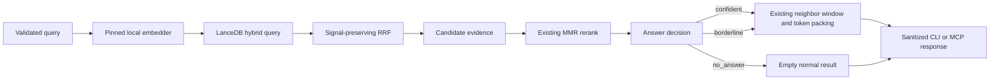

# Retrieval Confidence Pipeline Design

**Date:** 2026-07-13
**Status:** Revised after maintainer review; awaiting final approval

## Summary

This design replaces nowdocs' binary cosine cutoff with an
evidence-preserving, three-state retrieval decision: `confident`, `borderline`,
or `no_answer`.
This is not a request to lower the existing threshold. The first work must be
to expand the evaluation set, capture the current baseline, and preserve the
channel ranks and membership evidence that LanceDB's built-in RRF reranker
currently discards.

The implementation remains a local, single-binary documentation retrieval
runtime. Phase 1 does not add a second model, a hosted service, query rewriting,
or enterprise data-platform features.

## Problem Statement

The current answer gate in `src/retrieve.rs` accepts a result when either:

- the top MMR-selected hit has cosine similarity at or above `0.82`; or
- one chunk has the RRF score associated with rank-1 agreement in both dense
  and full-text retrieval.

The `0.82` value was calibrated on 10 positive and 12 negative Next.js
queries. It separated those samples, but it does not generalize to all natural
query forms. In live testing, the short and relevant query `middleware
matcher` produced a top cosine near `0.8186` and was rejected, while the longer
documented smoke query passed.

This creates two coupled failures:

1. The retrieval system turns a small calibration error into a hard false
   negative.
2. `nowdocs smoke` describes the empty result as a likely installation problem
   and recommends `doctor`, even when the docset and model are healthy.

There is also an architectural constraint: `Store::hybrid_search` delegates
fusion to LanceDB's built-in RRF reranker, whose output retains only the fused
`_relevance_score`. Dense and FTS channel membership and rank are not available
to the answer decision. LanceDB 0.31 normalizes `_distance` and `_score` before
calling a custom reranker, so that interface cannot preserve raw vector
distance or raw BM25 score. Running separate hybrid, dense, and FTS queries
would recover additional raw values but would duplicate work and distort
latency.

## Goals

1. Reduce false rejection of short, relevant documentation queries without
   broadly admitting unrelated answers.
2. Represent retrieval confidence explicitly as `confident`, `borderline`, or
   `no_answer`.
3. Preserve dense/lexical channel membership, channel ranks, and fusion
   evidence in one hybrid query without changing baseline RRF ordering.
4. Make CLI and MCP responses distinguish a healthy no-answer decision from an
   operational failure.
5. Replace single-answer evaluation labels with multi-target, graded labels and
   measure candidate ranking separately from answer-state calibration.
6. Keep the design small enough for one focused implementation plan.

## Non-goals and Product Boundary

This design does not turn nowdocs into a general enterprise RAG database.
nowdocs remains an opinionated local documentation retrieval product:

- explicit local docsets;
- a pinned local embedding model;
- LanceDB-backed hybrid retrieval;
- sanitized, read-only MCP search over stdio;
- explicit CLI operations for installation and maintenance.

Phase 1 does **not** include:

- multi-tenancy, RBAC, hosted APIs, connectors, or ingestion orchestration;
- a cross-encoder or other second-stage model;
- cloud telemetry or raw-query logging;
- query rewriting, decomposition, or intent classification;
- a general retriever/reranker plugin framework;
- a persistent `DocumentId` migration;
- context-builder changes such as section merging, code-block repair, or
  per-document output caps;
- moving MMR or changing its objective before evaluation shows a benefit.

Context assembly already has a separate responsibility: neighbor expansion,
relevance-first ordering, sanitization, and token packing. Any future context
builder redesign requires its own specification.

## Design Principles

- **Evaluate before tuning.** A new state machine must not be calibrated on the
  same small sample that exposed the current overfit.
- **Preserve behavior before changing behavior.** Signal-retention work must
  reproduce existing RRF scores and ordering first.
- **State score semantics exactly.** Query-local normalized values are not raw
  scores or probabilities; the policy uses recomputed cosine and ranks whose
  meanings are explicit.
- **Separate ranking from decision.** Retrieval chooses candidates; a small,
  pure policy decides whether those candidates justify an answer.
- **Treat uncertainty as data.** `borderline` is a normal retrieval outcome,
  not an exception and not an installation diagnosis.
- **Do not expose internal scores to MCP clients.** Scores remain diagnostic
  implementation details until their semantics are stable.
- **Prefer concrete components.** One concrete LanceDB reranker and one pure
  confidence module are sufficient; no application-level trait graph is
  needed.

## Proposed Architecture



The implementation introduces one small module and one concrete adapter:

- `src/store.rs` owns `SignalPreservingRrf` and `CandidateEvidence` because it
  already owns LanceDB queries and Arrow result parsing.
- `src/confidence.rs` owns `AnswerState`, `QueryEvidence`, `AnswerDecision`, and
  the pure decision function.
- `src/retrieve.rs` continues to orchestrate embedding, retrieval, MMR,
  decision, neighbor expansion, and token assembly.

No further module split is part of Phase 1.

## Signal-preserving Hybrid Retrieval

### Concrete LanceDB adapter

`SignalPreservingRrf` implements LanceDB 0.31's required `Reranker` interface.
It receives the vector and FTS `RecordBatch` values already produced by one
hybrid query. Those batches have already passed through LanceDB's query-local
score normalization. The adapter must:

1. reproduce the built-in `RRFReranker` formula exactly, including its
   zero-based channel positions and configured `k = 60`;
2. return the same merged rows, `_relevance_score` values, and descending
   ordering as the built-in implementation for the same input batches;
3. attach nullable, one-based evidence columns for dense rank and FTS rank;
4. preserve one-channel candidates with null evidence for the missing channel;
5. avoid a second vector or FTS query.

Tie behavior must be characterized against the current LanceDB implementation
and then locked by tests. The adapter is a concrete compatibility layer, not a
new configurable fusion framework. It does not claim to retain raw BM25 score
or raw vector distance, and it does not add query-local normalized score
columns to `CandidateEvidence` in Phase 1.

### Candidate evidence

Store parsing returns a `CandidateEvidence` value keyed by the existing
`chunk_idx` and `source_url`. It contains:

- optional one-based dense rank;
- optional one-based lexical rank;
- the fused RRF score;
- the existing chunk metadata needed downstream.

`retrieve.rs` continues to fetch stored vectors for MMR. It also computes the
raw query-to-chunk cosine used by the current gate from those vectors, so the
decision does not assume a particular interpretation of LanceDB distance. Raw
BM25 score is explicitly unavailable to the single-query Phase 1 policy. If a
future evaluation proves it necessary, recovering it requires a separately
reviewed query-path and latency trade-off.

There is no new persistent document identifier. `chunk_idx` is the stable key
within a docset for this phase, and `source_url` supports evaluation and source
diversity.

## Answer Decision

### Types

`AnswerState` has exactly three serialized values:

- `confident`: return selected chunks without a warning;
- `borderline`: return selected chunks with an uncertainty warning;
- `no_answer`: return no chunks, but report a normal retrieval outcome.

`QueryEvidence` is a compact summary created before the decision and before
neighbor expansion. It combines a snapshot of the pre-MMR fused pool with the
existing MMR-selected hits. It contains:

- the top selected candidate's recomputed raw cosine and fused RRF score,
  preserving the current binary gate inputs;
- the top two raw cosine values across the pre-MMR fused pool and their margin;
- whether the top-cosine pre-MMR candidate appears in both retrieval channels;
- that candidate's dense and lexical ranks.

The calibrated policy may use a subset of these fixed fields, but only when an
ablation improves grouped development evaluation. Heading-token overlap and
other new query-analysis features are excluded from Phase 1.

`AnswerDecision` contains the state plus an internal reason code suitable for
tests and local debug traces. It does not contain user-facing prose and its raw
evidence is not serialized to MCP.

### Migration behavior

The state machine is introduced in two behavior stages:

1. **Binary-equivalent stage:** map the current gate to `confident` or
   `no_answer`. This changes response semantics and wording, but not which
   queries receive chunks.
2. **Calibrated three-state stage:** introduce `borderline` only after the
   expanded evaluation set and frozen test show that it meets all
   acceptance gates.

Policy thresholds are not selected in this design document. Before calibration,
the implementation fixes a small monotonic policy family: stronger cosine,
better channel ranks, or added cross-channel agreement cannot lower the answer
state. One global policy applies to all docsets; per-docset thresholds are not
allowed.

Threshold search and feature ablation use only the development split, with
grouped cross-validation by intent family. Among development policies that
pass every gate, selection maximizes decisive coverage; ties prefer lower
negative false-accept rate, then lower positive false-reject rate, then higher
nDCG@5. After the policy and constants are frozen, the test split is evaluated
for acceptance and then becomes a continuous regression suite. A test failure
does not authorize tuning against that split: new intent families must be
labeled in a new dataset revision, while the failed test cases remain permanent
regressions. The chosen constants and development/test metrics are committed
with the implementation. A policy that misses any gate does not ship; the
binary-equivalent state remains the fallback.

The decision point stays after MMR during Phase 1 to preserve current behavior
and remains before neighbor expansion so context chunks cannot inflate
confidence. Distribution features such as the cosine margin are computed from
the pre-MMR pool because MMR's diversity objective changes the runner-up. If
there are no primary candidates, the state is `no_answer`.

## Public Response Contracts

### Retrieval result

`SearchResult` adds `answer_state`. Its invariants are:

- `confident` and `borderline` contain one or more primary hits before neighbor
  context is assembled;
- `no_answer` contains zero chunks, zero returned tokens, and
  `truncated = false`;
- store, model, manifest, and input failures remain errors rather than answer
  states.

### MCP `nowdocs_search`

The current structured response shape is preserved and extended:

```json
{
  "structuredContent": {
    "answer_state": "no_answer",
    "chunks": [],
    "tokens_returned": 0,
    "truncated": false
  }
}
```

The existing `chunks`, `tokens_returned`, and `truncated` field names do not
change.

The text fallback must also state the answer state. For `borderline`, it adds a
short uncertainty warning before the sanitized chunks. For `no_answer`, it
states that no sufficiently supported match was found and returns no chunk
text. It must not recommend installation repair.

All text and metadata still pass through the existing sanitizer. Internal
cosine, BM25, vector-distance, channel-rank, and RRF values are not exposed to
the LLM. All three answer states are normal tool results without `isError`;
manifest, model, store, and protocol failures keep the existing error contract.

### CLI `nowdocs smoke`

`SmokeResult` preserves its current fields and adds `answer_state`.
`results` and `result_count` remain CLI-only names and are not copied into the
MCP contract.

The current JSON `score` field remains for compatibility and keeps its RRF
meaning in Phase 1. Human output labels it `rrf_score` to avoid presenting it
as a calibrated probability. No additional raw evidence fields are added.

Exit and display behavior is explicit:

| State or failure | Exit | Human output | JSON output |
|---|---:|---|---|
| `confident` | 0 | `smoke ok` | complete `SmokeResult` |
| `borderline` | 0 | `smoke warning` plus results | complete `SmokeResult` |
| `no_answer` | 1 | `smoke no-answer`, no repair hint | complete `SmokeResult` with empty results |
| operational failure | non-zero | targeted diagnostic | existing error object/diagnostic |

This preserves smoke's usefulness in scripts while preventing a healthy
no-answer decision from impersonating a damaged installation. `doctor` remains
the source of truth for installation health.

The MCP change is additive: existing structured fields remain present and
clients that ignore unknown fields continue to work. The CLI JSON change for
`no_answer` is an intentional v0.x contract correction: it replaces the current
`{"error":"no results","hint":...}` object with an empty `SmokeResult` and
`answer_state = "no_answer"`. The human score label also changes from `score`
to `rrf_score`. Both changes require contract tests and a release-note migration
example; JSON automation must branch on `answer_state`, while operational
failures continue to use the error object.

## Evaluation Design

### Label model

The current single `expected_source_url` is replaced with multi-target, graded
relevance. Each query record contains:

- stable query ID;
- docset;
- query text;
- fixed split: development or test;
- intent family, used to prevent paraphrase leakage between splits;
- query form: short, natural-language, verbose, or keyword-heavy;
- query class: positive, near-domain negative, or cross-domain negative;
- zero or more relevance targets with `source_url`, optional
  `heading_path_prefix`, and grade.

Grades have fixed meanings:

- `2`: directly answers the intent;
- `1`: useful supporting material but not the primary answer;
- `0` or absent: not relevant.

Positive queries require at least one grade-1 or grade-2 label. Negative
queries require no positive labels. Near-domain negatives are lexically or
conceptually adjacent but not answered by the selected docset; cross-domain
negatives are clearly unrelated.

A primary hit matches a target when `source_url` is equal. When a
`heading_path_prefix` is supplied, the evaluator normalizes it with the same
heading-path normalization used during chunking and requires either an exact
match or a descendant segment beginning with `" > "`; a partial heading name
does not match. `chunk_idx` is not a label key because chunking changes can
renumber it. For MRR, nDCG, and Precision, each relevance target grants gain
only on its first matching hit; additional chunks matching the same target
receive zero gain and therefore cannot inflate metrics through duplication.

The initial real-corpus suite covers the curated Next.js, React, and Vue
docsets. Before the three-state policy can ship, each docset must contain at
least 40 positive and 30 negative intent families: at least 20 positive and 15
negative families in development, and at least 20 positive and 15 negative
families in the frozen test split. At least half of each split's negatives are
near-domain. Query variants belonging to the same intent family must stay in
the same fixed split.

The versioned labels live under `tests/fixtures/eval/`, separated by docset.
The implementation also records a baseline report under
`docs/superpowers/evals/`. The report records the code commit, command,
retrieval parameters, OS/architecture, each docset's `doc_version`, manifest
SHA-256, chunk count, model revision and SHA-256, aggregate metrics, and
risk-group metrics. Per-query debug evidence is generated locally and is not
committed unless it contains query IDs rather than raw query text.

### Ranking metrics

Ranking metrics are computed over positive queries and primary retrieval hits,
not neighbor context. They identify the first stage at which an acceptable
target disappears:

- dense Recall@40 and FTS Recall@40 before fusion;
- fused Recall@40 before MMR;
- MMR Recall@5 before answer decision;
- output Recall@5: any grade-1 or grade-2 source returned after decision;
- MRR, nDCG@5, and Precision@5 at both the MMR and output stages.

Dense and FTS Recall@40 use the existing diagnostic `vector_search` and
`fts_search` paths inside the evaluator, because a fused top-40 response cannot
show channel candidates that fusion removed. Those extra queries are
evaluation-only; normal retrieval still executes one hybrid query.

MRR uses the first grade-1 or grade-2 target. nDCG@5 uses gain
`(2^grade) - 1` with logarithmic rank discount. Precision@5 is relevant
returned primary hits divided by up to five returned primary hits, with an
empty output scored as zero. The one-gain-per-target rule applies to all three.

The current release thresholds of output Recall@5 at least `0.90` and output
MRR at least `0.70` remain minimum non-regression gates until the expanded
baseline supports a deliberately reviewed replacement. nDCG@5 and Precision@5
first establish a baseline; they become release gates only through a separate
reviewed change.

### Answer-state metrics

For positive queries:

- false-reject rate = `no_answer / positive queries`;
- positive-borderline rate = `borderline / positive queries`.

For negative queries:

- false-accept rate = `confident / negative queries`;
- negative-borderline rate = `borderline / negative queries`.

Across all labeled queries:

- decisive coverage = `(confident + no_answer) / all queries`.

Phase 1 acceptance gates are:

- positive false-reject rate at most `5%`;
- negative false-accept rate at most `10%`;
- decisive coverage at least `80%`;
- no regression below existing Recall@5 or MRR release gates;
- the short Next.js query `middleware matcher` is not `no_answer` and returns at
  least one grade-1 or grade-2 source;
- a healthy `no_answer` smoke run never recommends `doctor` or reinstall.

The rate and ranking gates must pass both across the combined frozen test suite
and independently for each docset. A strong framework cannot mask a weak one.
These are operational point-estimate release gates, not claims of population
certainty. Every report includes the numerator, denominator, and a 95% Wilson
interval for false-reject, false-accept, and borderline rates. The per-docset
minimums make the gates discrete: with 20 positive test families, at most one
may be `no_answer`; with 15 negative test families, at most one may be
`confident`.

Rates are reported separately for short queries and for near-domain negatives
so aggregate performance cannot hide the two risk groups that motivated this
work.

### Evaluation execution and CI

The evaluator emits one versioned JSON report rather than requiring CI to
parse human log lines. The report contains corpus identity, policy identity,
stage metrics, answer-state counts/rates/intervals, risk-group metrics, and
per-query results keyed by query ID.

The nightly and manual eval workflow prepares and caches the pinned Next.js,
React, and Vue fixtures independently, uploads the JSON report as an artifact,
and prints a short human summary. Manual dispatch enforces release gates from
the JSON fields; nightly runs report the same fields and fail on evaluator or
fixture errors. Existing stale comments and text-grep threshold parsing in the
workflow are removed as part of the evaluation-first stage.

### Performance guardrail

Signal retention must not add another vector, FTS, or hybrid query to normal
search. A release-build benchmark runs the fixed evaluation queries in one
warmed process on the same machine and corpus before and after the adapter
change. The baseline report records median and p95 end-to-end retrieval time.
The Phase 1 adapter passes when median retrieval time increases by no more than
`10%`; p95 is reported for review but is not a hard gate because local tail
latency is noisy. Debug trace construction is disabled outside evaluation or an
explicit local debug request.

## Test Strategy

1. **Pure metric tests:** multi-target Recall, MRR, nDCG, precision, Wilson
   intervals, and tri-state confusion arithmetic, including empty inputs,
   heading-prefix matching, and duplicate chunks from one target.
2. **RRF compatibility tests:** feed synthetic Arrow batches to the built-in
   and signal-preserving rerankers and assert identical candidate IDs, ordering,
   and fused scores, while checking one-based channel ranks and nulls for
   single-channel candidates.
3. **Pure decision tests:** construct synthetic `QueryEvidence` values around
   policy boundaries and assert states, reason codes, and monotonicity without
   loading a model.
4. **Behavior characterization:** before enabling `borderline`, assert that the
   new pipeline returns the same ordered primary IDs and binary accept/reject
   decisions as the current pipeline on pinned fixtures.
5. **Real-corpus regression:** run the expanded Next.js, React, and Vue suite
   against installed docsets and emit the ranking and state metrics above.
6. **Contract tests:** verify MCP structured content and text fallback, CLI JSON,
   human wording, exit codes, and the distinction between `no_answer` and
   operational errors.
7. **Evaluation contract tests:** validate the versioned fixture/report schemas,
   reject intent families split across development and test, and prove that
   policy selection receives no test records.

Tests must not assert the observed `0.8186` floating-point value. The regression
assertion is semantic: the pinned short query is not `no_answer` and recalls an
acceptable labeled source. Numeric unit tests use synthetic vectors and
tolerances.

## Local Observability

The implementation adds a local debug/evaluation trace containing candidate
IDs, channel ranks, fused RRF scores, recomputed cosine, MMR position, answer
state, and reason code. It is disabled in normal MCP output and must not log raw
query text by default. There is no remote telemetry.

Trace data exists to answer three questions during calibration:

1. Did each retrieval channel recall an acceptable source?
2. Did fusion or MMR move it outside the output cutoff?
3. Did the answer decision reject useful candidates or confidently accept a
   negative query?

## Implementation Sequence

The order is part of the design and must not be inverted:

1. Expand the evaluation schema to multi-target graded labels, add the
   versioned JSON report and three-docset CI path, and capture all current stage
   baselines before behavior changes.
2. Add behavior-preserving trace and characterization tests for the existing
   hybrid, MMR, and binary-gate pipeline.
3. Add the concrete signal-preserving RRF adapter and prove that it preserves
   built-in RRF ordering and scores without violating the performance guardrail.
4. Add `AnswerState` and public contracts using the binary-equivalent mapping;
   fix smoke and MCP no-answer semantics without yet introducing `borderline`.
5. Calibrate and enable `borderline` only if the frozen test evaluation meets
   every acceptance gate.
6. Independently compare built-in-style RRF, normalized fusion, and alternative
   MMR placement using the same evaluation suite. Do not switch ranking
   behavior without a measured gain and a separately reviewed decision.

Context-builder enhancements are excluded from this sequence and require a
separate specification.

## Risks and Mitigations

| Risk | Mitigation |
|---|---|
| The expanded suite is still too small | Cover three docsets, group paraphrases by intent, freeze the test split, report exact counts and intervals, and preserve failed cases as regressions. |
| Test data leaks into policy selection | Validate split membership by intent family, expose only development records to calibration, and evaluate the frozen test after policy freeze. |
| `borderline` hides poor calibration | Enforce decisive coverage in addition to false-accept and false-reject gates. |
| Custom RRF silently changes ranking | Compare it directly with LanceDB's implementation on synthetic and fixture batches before using retained signals. |
| Normalized channel values are mistaken for raw scores | Use ranks and recomputed cosine in the Phase 1 policy; name any diagnostic normalized values explicitly. |
| Extra diagnostics leak to agents | Keep raw evidence internal and expose only `answer_state` plus sanitized text. |
| CLI changes break scripts | Preserve `SmokeResult` fields, add one field, keep explicit exit semantics, and retain the JSON `score` field. |
| Three-docset nightly evaluation becomes too slow | Cache each pinned fixture independently, benchmark the workflow, and keep the manual release gate reproducible locally. |
| Scope expands into a RAG platform | Keep one local model, one store, one concrete adapter, and the existing docset/MCP product boundary. |
| Ranking and confidence changes become inseparable | Land baseline, signal retention, response semantics, and calibrated behavior in ordered, independently testable steps. |

## Completion Criteria

This design is implemented only when:

- the expanded evaluation data and metrics are committed and reproducible;
- the JSON evaluator drives the cached three-docset nightly/manual workflow;
- signal-preserving RRF is behavior-compatible with the current fusion path;
- the adapter meets the no-extra-query and median-latency guardrails;
- all three answer states follow the CLI and MCP contracts above;
- one global monotonic policy is frozen before test evaluation;
- the acceptance gates pass on frozen real-corpus test evaluation;
- current sanitizer, explicit-docset, stdio-only, pinned-model, and
  text-only-registry invariants remain intact;
- no second model, hosted service, context-builder redesign, or enterprise
  platform feature has entered the change set.
