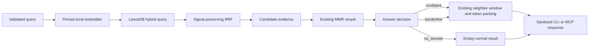

# Retrieval Confidence Pipeline Design

**Date:** 2026-07-13
**Status:** Approved direction; written specification awaiting maintainer review

## Summary

This design replaces nowdocs' binary cosine cutoff with an
evidence-preserving, three-state retrieval decision: `confident`, `borderline`,
or `no_answer`.
This is not a request to lower the existing threshold. The first work must be
to expand the evaluation set, capture the current baseline, and preserve the
raw dense and lexical evidence that LanceDB's built-in RRF reranker currently
discards.

The implementation remains a local, single-binary documentation retrieval
runtime. Phase 1 does not add a second model, a hosted service, query rewriting,
or enterprise data-platform features.

## Problem Statement

The current answer gate in `src/retrieve.rs` accepts a result when either:

- the top MMR-selected hit has cosine similarity at or above `0.82`; or
- one chunk has the RRF score associated with rank-1 agreement in both dense
  and full-text retrieval.

The `0.82` value was calibrated on 10 positive and 12 negative Next.js
queries. It separated those samples, but it does not generalize to all natural
query forms. In live testing, the short and relevant query `middleware
matcher` produced a top cosine near `0.8186` and was rejected, while the longer
documented smoke query passed.

This creates two coupled failures:

1. The retrieval system turns a small calibration error into a hard false
   negative.
2. `nowdocs smoke` describes the empty result as a likely installation problem
   and recommends `doctor`, even when the docset and model are healthy.

There is also an architectural constraint: `Store::hybrid_search` delegates
fusion to LanceDB's built-in RRF reranker, whose output retains only the fused
`_relevance_score`. Dense distance/rank and BM25 score/rank are not available
to the answer decision. Running separate hybrid, dense, and FTS queries would
recover those signals but would duplicate work and distort latency.

## Goals

1. Reduce false rejection of short, relevant documentation queries without
   broadly admitting unrelated answers.
2. Represent retrieval confidence explicitly as `confident`, `borderline`, or
   `no_answer`.
3. Preserve dense, lexical, and fusion evidence in one hybrid query without
   changing baseline RRF ordering.
4. Make CLI and MCP responses distinguish a healthy no-answer decision from an
   operational failure.
5. Replace single-answer evaluation labels with multi-answer, graded labels and
   measure candidate ranking separately from answer-state calibration.
6. Keep the design small enough for one focused implementation plan.

## Non-goals and Product Boundary

This design does not turn nowdocs into a general enterprise RAG database.
nowdocs remains an opinionated local documentation retrieval product:

- explicit local docsets;
- a pinned local embedding model;
- LanceDB-backed hybrid retrieval;
- sanitized, read-only MCP search over stdio;
- explicit CLI operations for installation and maintenance.

Phase 1 does **not** include:

- multi-tenancy, RBAC, hosted APIs, connectors, or ingestion orchestration;
- a cross-encoder or other second-stage model;
- cloud telemetry or raw-query logging;
- query rewriting, decomposition, or intent classification;
- a general retriever/reranker plugin framework;
- a persistent `DocumentId` migration;
- context-builder changes such as section merging, code-block repair, or
  per-document output caps;
- moving MMR or changing its objective before evaluation shows a benefit.

Context assembly already has a separate responsibility: neighbor expansion,
relevance-first ordering, sanitization, and token packing. Any future context
builder redesign requires its own specification.

## Design Principles

- **Evaluate before tuning.** A new state machine must not be calibrated on the
  same small sample that exposed the current overfit.
- **Preserve behavior before changing behavior.** Signal-retention work must
  reproduce existing RRF scores and ordering first.
- **Separate ranking from decision.** Retrieval chooses candidates; a small,
  pure policy decides whether those candidates justify an answer.
- **Treat uncertainty as data.** `borderline` is a normal retrieval outcome,
  not an exception and not an installation diagnosis.
- **Do not expose internal scores to MCP clients.** Scores remain diagnostic
  implementation details until their semantics are stable.
- **Prefer concrete components.** One concrete LanceDB reranker and one pure
  confidence module are sufficient; no application-level trait graph is
  needed.

## Proposed Architecture



The implementation introduces one small module and one concrete adapter:

- `src/store.rs` owns `SignalPreservingRrf` and `CandidateEvidence` because it
  already owns LanceDB queries and Arrow result parsing.
- `src/confidence.rs` owns `AnswerState`, `QueryEvidence`, `AnswerDecision`, and
  the pure decision function.
- `src/retrieve.rs` continues to orchestrate embedding, retrieval, MMR,
  decision, neighbor expansion, and token assembly.

No further module split is part of Phase 1.

## Signal-preserving Hybrid Retrieval

### Concrete LanceDB adapter

`SignalPreservingRrf` implements LanceDB 0.31's required `Reranker` interface.
It receives the vector and FTS `RecordBatch` values already produced by one
hybrid query. It must:

1. reproduce the built-in `RRFReranker` formula exactly, including its
   zero-based channel positions and configured `k = 60`;
2. return the same merged rows, `_relevance_score` values, and descending
   ordering as the built-in implementation for the same input batches;
3. attach nullable evidence columns for vector rank, vector distance, FTS
   rank, and FTS score;
4. preserve one-channel candidates with null evidence for the missing channel;
5. avoid a second vector or FTS query.

Tie behavior must be characterized against the current LanceDB implementation
and then locked by tests. The adapter is a concrete compatibility layer, not a
new configurable fusion framework.

### Candidate evidence

Store parsing returns a `CandidateEvidence` value keyed by the existing
`chunk_idx` and `source_url`. It contains:

- optional dense rank and vector distance;
- optional lexical rank and BM25 score;
- the fused RRF score;
- the existing chunk metadata needed downstream.

`retrieve.rs` continues to fetch stored vectors for MMR. It also computes the
query-to-chunk cosine used by the current gate from those vectors, so the
decision does not assume a particular interpretation of LanceDB distance.

There is no new persistent document identifier. `chunk_idx` is the stable key
within a docset for this phase, and `source_url` supports evaluation and source
diversity.

## Answer Decision

### Types

`AnswerState` has exactly three serialized values:

- `confident`: return selected chunks without a warning;
- `borderline`: return selected chunks with an uncertainty warning;
- `no_answer`: return no chunks, but report a normal retrieval outcome.

`QueryEvidence` is a compact summary derived after the existing MMR selection
and before neighbor expansion. It contains:

- top query-to-chunk cosine;
- the cosine margin between the top two selected candidates;
- whether the top candidate appears in both retrieval channels;
- the top candidate's dense and lexical ranks;
- fused RRF score.

The calibrated policy may use a subset of these fixed fields, but only when an
ablation improves held-out evaluation. Heading-token overlap and other new
query-analysis features are excluded from Phase 1.

`AnswerDecision` contains the state plus an internal reason code suitable for
tests and local debug traces. It does not contain user-facing prose and its raw
evidence is not serialized to MCP.

### Migration behavior

The state machine is introduced in two behavior stages:

1. **Binary-equivalent stage:** map the current gate to `confident` or
   `no_answer`. This changes response semantics and wording, but not which
   queries receive chunks.
2. **Calibrated three-state stage:** introduce `borderline` only after the
   expanded evaluation set and held-out calibration show that it meets all
   acceptance gates.

Policy thresholds are not selected in this design document. The implementation
must derive them through a deterministic search over a development split,
grouped by intent family so paraphrases of one concept cannot leak across
development and held-out sets. Among policies that pass every gate, selection
maximizes decisive coverage; ties prefer lower negative false-accept rate, then
lower positive false-reject rate, then higher nDCG@5. The chosen constants and
the corresponding metrics are committed with the implementation. A policy
that misses any gate does not ship; the binary-equivalent state remains the
fallback.

The decision point stays after MMR to preserve current behavior and before
neighbor expansion so context chunks cannot inflate confidence. If there are
no primary candidates, the state is `no_answer`.

## Public Response Contracts

### Retrieval result

`SearchResult` adds `answer_state`. Its invariants are:

- `confident` and `borderline` contain one or more primary hits before neighbor
  context is assembled;
- `no_answer` contains zero chunks, zero returned tokens, and
  `truncated = false`;
- store, model, manifest, and input failures remain errors rather than answer
  states.

### MCP `nowdocs_search`

The current structured response shape is preserved and extended:

```json
{
  "structuredContent": {
    "answer_state": "no_answer",
    "chunks": [],
    "tokens_returned": 0,
    "truncated": false
  }
}
```

The existing `chunks`, `tokens_returned`, and `truncated` field names do not
change.

The text fallback must also state the answer state. For `borderline`, it adds a
short uncertainty warning before the sanitized chunks. For `no_answer`, it
states that no sufficiently supported match was found and returns no chunk
text. It must not recommend installation repair.

All text and metadata still pass through the existing sanitizer. Internal
cosine, BM25, vector-distance, channel-rank, and RRF values are not exposed to
the LLM. All three answer states are normal tool results without `isError`;
manifest, model, store, and protocol failures keep the existing error contract.

### CLI `nowdocs smoke`

`SmokeResult` preserves its current fields and adds `answer_state`.
`results` and `result_count` remain CLI-only names and are not copied into the
MCP contract.

The current JSON `score` field remains for compatibility and keeps its RRF
meaning in Phase 1. Human output labels it `rrf_score` to avoid presenting it
as a calibrated probability. No additional raw evidence fields are added.

Exit and display behavior is explicit:

| State or failure | Exit | Human output | JSON output |
|---|---:|---|---|
| `confident` | 0 | `smoke ok` | complete `SmokeResult` |
| `borderline` | 0 | `smoke warning` plus results | complete `SmokeResult` |
| `no_answer` | 1 | `smoke no-answer`, no repair hint | complete `SmokeResult` with empty results |
| operational failure | non-zero | targeted diagnostic | existing error object/diagnostic |

This preserves smoke's usefulness in scripts while preventing a healthy
no-answer decision from impersonating a damaged installation. `doctor` remains
the source of truth for installation health.

## Evaluation Design

### Label model

The current single `expected_source_url` is replaced with multi-answer, graded
relevance. Each query record contains:

- stable query ID;
- docset;
- query text;
- intent family, used to prevent paraphrase leakage between splits;
- query form: short, natural-language, verbose, or keyword-heavy;
- query class: positive, near-domain negative, or cross-domain negative;
- zero or more relevance labels with `source_url` and grade.

Grades have fixed meanings:

- `2`: directly answers the intent;
- `1`: useful supporting material but not the primary answer;
- `0` or absent: not relevant.

Positive queries require at least one grade-1 or grade-2 label. Negative
queries require no positive labels. Near-domain negatives are lexically or
conceptually adjacent but not answered by the selected docset; cross-domain
negatives are clearly unrelated.

The initial real-corpus suite covers the curated Next.js, React, and Vue
docsets. Before the three-state policy can ship, each docset must contain at
least 30 positive and 20 negative intent families, and its held-out portion
must contain at least 20 positive and 10 negative families. At least half of
each docset's negatives are near-domain. Query variants belonging to the same
intent family must stay in the same calibration split.

The versioned labels live under `tests/fixtures/eval/`, separated by docset.
The implementation also records a baseline report under
`docs/superpowers/evals/` with the docset manifest versions, model revision,
commands, aggregate metrics, and risk-group metrics. Per-query debug evidence
is generated locally and is not committed unless it contains query IDs rather
than raw query text.

### Ranking metrics

Ranking metrics are computed over positive queries and primary retrieval hits,
not neighbor context:

- candidate Recall@5: any grade-1 or grade-2 source in the MMR-selected top
  five before answer decision;
- output Recall@5: any grade-1 or grade-2 source returned after decision;
- MRR: reciprocal rank of the first grade-1 or grade-2 source;
- nDCG@5: gain `(2^grade) - 1` with logarithmic rank discount over the fixed
  0/1/2 labels;
- Precision@5: relevant returned primary hits divided by up to five returned
  primary hits, with an empty output scored as zero.

The current release thresholds of Recall@5 at least `0.90` and MRR at least
`0.70` remain minimum non-regression gates until the expanded baseline supports
a deliberately reviewed replacement. nDCG@5 and Precision@5 first establish a
baseline; they become release gates only through a separate reviewed change.

### Answer-state metrics

For positive queries:

- false-reject rate = `no_answer / positive queries`;
- positive-borderline rate = `borderline / positive queries`.

For negative queries:

- false-accept rate = `confident / negative queries`;
- negative-borderline rate = `borderline / negative queries`.

Across all labeled queries:

- decisive coverage = `(confident + no_answer) / all queries`.

Phase 1 acceptance gates are:

- positive false-reject rate at most `5%`;
- negative false-accept rate at most `10%`;
- decisive coverage at least `80%`;
- no regression below existing Recall@5 or MRR release gates;
- the short Next.js query `middleware matcher` is not `no_answer` and returns at
  least one grade-1 or grade-2 source;
- a healthy `no_answer` smoke run never recommends `doctor` or reinstall.

The rate and ranking gates must pass both across the combined held-out suite
and independently for each docset. A strong framework cannot mask a weak one.

Rates are reported separately for short queries and for near-domain negatives
so aggregate performance cannot hide the two risk groups that motivated this
work.

## Test Strategy

1. **Pure metric tests:** multi-label Recall, MRR, nDCG, precision, and
   tri-state confusion arithmetic, including empty inputs and multiple valid
   sources.
2. **RRF compatibility tests:** feed synthetic Arrow batches to the built-in
   and signal-preserving rerankers and assert identical candidate IDs, ordering,
   and fused scores, while checking retained channel evidence.
3. **Pure decision tests:** construct synthetic `QueryEvidence` values around
   policy boundaries and assert states and reason codes without loading a model.
4. **Behavior characterization:** before enabling `borderline`, assert that the
   new pipeline returns the same ordered primary IDs and binary accept/reject
   decisions as the current pipeline on pinned fixtures.
5. **Real-corpus regression:** run the expanded Next.js, React, and Vue suite
   against installed docsets and emit the ranking and state metrics above.
6. **Contract tests:** verify MCP structured content and text fallback, CLI JSON,
   human wording, exit codes, and the distinction between `no_answer` and
   operational errors.

Tests must not assert the observed `0.8186` floating-point value. The regression
assertion is semantic: the pinned short query is not `no_answer` and recalls an
acceptable labeled source. Numeric unit tests use synthetic vectors and
tolerances.

## Local Observability

The implementation adds a local debug/evaluation trace containing candidate
IDs, ranks, scores, derived cosine, MMR position, answer state, and reason code.
It is disabled in normal MCP output and must not log raw query text by default.
There is no remote telemetry.

Trace data exists to answer three questions during calibration:

1. Did each retrieval channel recall an acceptable source?
2. Did fusion or MMR move it outside the output cutoff?
3. Did the answer decision reject useful candidates or confidently accept a
   negative query?

## Implementation Sequence

The order is part of the design and must not be inverted:

1. Expand the evaluation schema to multi-answer graded labels and capture the
   current output baseline before behavior changes.
2. Add behavior-preserving trace and characterization tests for the existing
   hybrid, MMR, and binary-gate pipeline.
3. Add the concrete signal-preserving RRF adapter and prove that it preserves
   built-in RRF ordering and scores.
4. Add `AnswerState` and public contracts using the binary-equivalent mapping;
   fix smoke and MCP no-answer semantics without yet introducing `borderline`.
5. Calibrate and enable `borderline` only if the held-out evaluation meets every
   acceptance gate.
6. Independently compare built-in-style RRF, normalized fusion, and alternative
   MMR placement using the same evaluation suite. Do not switch ranking
   behavior without a measured gain and a separately reviewed decision.

Context-builder enhancements are excluded from this sequence and require a
separate specification.

## Risks and Mitigations

| Risk | Mitigation |
|---|---|
| The expanded suite is still too small | Cover three docsets, group paraphrases by intent, keep a held-out split, and report risk-group metrics. |
| `borderline` hides poor calibration | Enforce decisive coverage in addition to false-accept and false-reject gates. |
| Custom RRF silently changes ranking | Compare it directly with LanceDB's implementation on synthetic and fixture batches before using retained signals. |
| Extra diagnostics leak to agents | Keep raw evidence internal and expose only `answer_state` plus sanitized text. |
| CLI changes break scripts | Preserve `SmokeResult` fields, add one field, keep explicit exit semantics, and retain the JSON `score` field. |
| Scope expands into a RAG platform | Keep one local model, one store, one concrete adapter, and the existing docset/MCP product boundary. |
| Ranking and confidence changes become inseparable | Land baseline, signal retention, response semantics, and calibrated behavior in ordered, independently testable steps. |

## Completion Criteria

This design is implemented only when:

- the expanded evaluation data and metrics are committed and reproducible;
- signal-preserving RRF is behavior-compatible with the current fusion path;
- all three answer states follow the CLI and MCP contracts above;
- the acceptance gates pass on held-out real-corpus evaluation;
- current sanitizer, explicit-docset, stdio-only, pinned-model, and
  text-only-registry invariants remain intact;
- no second model, hosted service, context-builder redesign, or enterprise
  platform feature has entered the change set.
